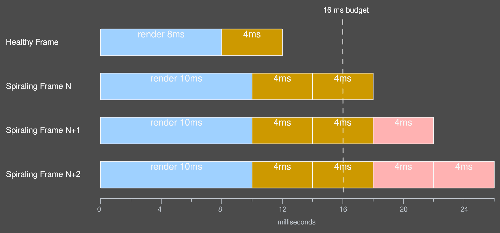
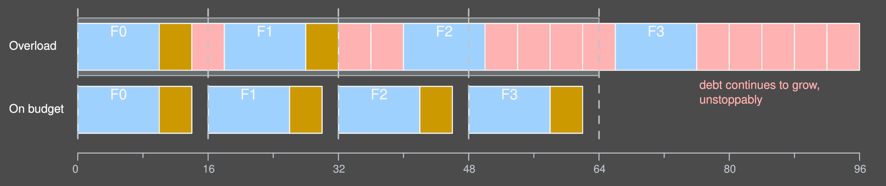
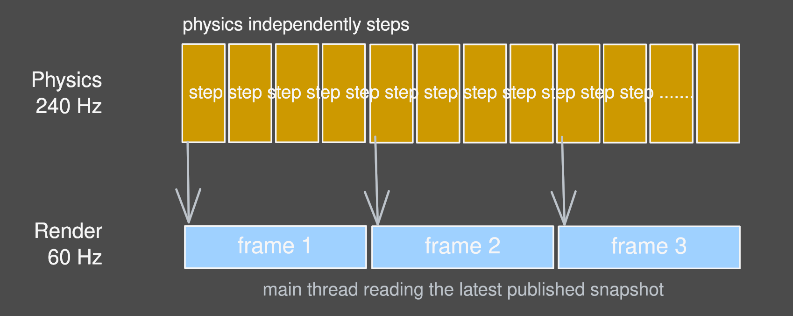

In the [last article](https://yugumishra.github.io/Yope3D/blog/the-rewrite/), I destroyed Yope3D as you saw it with Java + LWJGL and remade it in C++20 + Vulkan. Now that the foundation has been built anew, the series will go over the insights I gained rebuilding it and the major decisions I deliberated over, the first of which is keeping physics entirely on its own thread (apart from every other engine function).

We'll plant our roots somewhere unexpected: human perception. From there, we'll go through the framerate debacle and strict requirements, the hard-fought struggle for both determinism and real-time sync in the same solver, the elegant sidestep that is a threaded solution, and the ripple effects of this decision through Yope3D's architecture. From the perception of motion to the final solution (necessities, ramifications, and real engine code), we'll tread along the path I did when building Yope3D. By the end, you won't be seeing multithreading as just an optimization. You'll see it as the natural conclusion of every constraint we discover. 

## The eye you must appease

Far before any line of code gets written about a dynamic physics engine, you must consider human perception. We, as an artifact of our evolution, do more mental processing than meets the eye. We apply estimates and models in our heads and predict the next expected step in an object's trajectory because that is what rewards us; drives our brains to learn and improve. 

This processing is a double edged sword. On one hand, due to the brain's constant comparison between its model and what is accepted as reality, any disagreement between the user's **model** of the movement and the actual movement will scream out to them. 

In a physics engine that simulates complex rigid body dynamics, the movement is orders of magnitude more complex and the user has, quite literally, been training **their whole life** to identify errors. This is wonderful for debugging and finding obvious bugs but makes intermediate, untuned, builds look flawed.

But on the other, far greater, hand, it allows for the **discretization of motion**. You can lower the resolution in the time domain because the viewer's brain will fill in the gaps with what's not there. In essence, all motion is faked: the brain interprets the fast moving slideshow as real motion.

This one principle informs nearly any computer based dynamic visual system through the concept of **frames**. Like a slideshow, you only show one frame (or one image) at a time[^1], but only for a short time, moving through thousands of frames to show motion to the user. The speed at which a monitor displays these frames is called **refresh rate**. The speed at which you compute said frames is called **framerate**.

Framerate is what accounts for a lot of the smoothness of the visuals, but it isn't easy cranking it up. However, for a physics engine, this is an unavoidable cost. The demo below shows what happens when you sample frames too far apart in time (below the Nyquist rate, obscuring the real signal) and the visual choppiness of even decipherable framerates.

video here.

Up to this point we've only talked about what the user sees. But all of that smooth motion is really quite demanding: every frame has a limited amount of time to be computed. 

The rest of this article is really about what happens when the engine can't stay inside that budget.


## The frame budget and its harshness

The naïve solution is to just race: do everything the engine needs in one frame (rendering, physics, etc) as fast as possible and submit the image for that frame whenever it's finished. If we finish early (within the budget of time, typically 16ms/60Hz), great! We can block and wait until the next frame starts.

The problem is when we don't finish early. Or if we finish the work in a different amount of time than the framerate requires. Or if we don't finish the work in a consistent amount of time at all (yes this means even finishing early, because the CPU is twiddling its thumbs blocking when it could be doing other valuable work). You can start to understand why this is a real problem. 

Frame-to-frame, the engine's workloads vary simply because of intermittent tasks the engine has to do. You may have to load in the next level once in a certain region. That work has got to begin in one frame or another. The frame that load begins you can expect a longer frame time. The physics system, as you can imagine with its complex workload calculating magic numbers for ragdolls and whatnot, is going to be the main variable frame burden. 

The net effect of bad, inconsistent, frame scheduling can be perceived as slowdown (if the work takes a bit longer than expected, due to stale frames from the past still on screen) or freezes (for catastrophically long waits). 

**And**, with varying timeframes between frames, keeping sync with real time becomes much harder. This is the crux of the matter: timekeeping. There are a few options, which naturally guide us to a threaded solution. 

## Timekeeping solutions

### Iteration 1: variable timestep

The physics could simulate a larger step size whenever the frame takes longer. However this is terrible for having the solver produce the same outcome from the same state (reproducibility) and keeping the simulation stable / realistic. 

Due to the **discretization of motion** principle, the physics itself must run in discrete steps[^2], informed by the size of each step by a delta time variable (dt). This step size permeates every physics action the solver takes (for reasons we'll discuss later), and with a larger step size the physics solver **simply outputs different values**, and often more unstable values. On the catastrophic wait case/spike case, the physics may simply break when the timestep becomes so grotesquely large that internal assumptions aren't true.

Furthermore, without the assumption of constant step size, the same game state could have different outcomes (structure topples or doesn't topple) since the physics could operate on different timesteps because one machine takes a bit longer to crunch the numbers. And, if the engine needs to reproduce it exactly later, it'll have to keep track of each timestep size for the entire sequence of simulation (an even harder schedule to keep).  

```cpp
//pseudocode of the described technique
while (running) {
    float dt = clock.tick();   //measure how long the last frame took
    render();
    physics.step(dt);          // step based on the real time measured dt
}
```

> **Verdict:** keeps sync, but every slightly different run alters simulation outcomes for the unstable.

### Iteration 2: fixed timestep

Another option, to avoid these drawbacks, is to assume a **fixed time step** always occurs. In simulation, this addresses all of the concerns we had above (the assumption of constant step size allows a lot) and simplifies the code greatly. The only problem is, well, we're not keeping sync with real time anymore! Slowdowns occur and the simulation, once behind, will always stay behind. In the catastrophic wait, you see a freeze before the simulation resumes. 

```cpp
//the 2nd iteration
//somewhere else
const float DT = 0.0166f; // a sample DT value

//main simulator loop
while (running) {
    clock.tick();              // continue measuring, but don't use its result in the physics
    render();
    physics.step(DT);          // always update on the same dt (nets determinism but drifts)
}
```

> **Verdict:** perfectly reproducible, but there is no sync to real time once fallen behind

These 2 solutions, in trying to solve the clock sync problem, have traded one essential requirement for another. Variable timestep chooses sync over determinism while fixed timestep chooses determinism over sync. The next iterations try and keep both.

### Iteration 3: the accumulator

The third iteration of the timekeeping solution is to take advantage of the transient nature of workloads. We can continue to assume a fixed time step, but allow a greater number of **substeps** within a frame. The engine takes note of how many steps the simulation is behind by (accumulator) and catches the engine up by doing exactly that many substeps. It works wonders! Easy workloads are perfectly unchanged with determinism and reproducibility provided by the fixed timestep assumption while also allowing the simulation to crawl back the lost time after any time loss, provided the workload lessens.

```cpp
//iteration 3, substepped recovery
float accum = 0;
while (running) {
    accum += clock.tick();     //measure the real time that elapsed
    render();
    while (accum >= DT) {      //...then catch up, one fixed DT step at a time
        physics.step(DT);
        accum -= DT;
    }                         
}
```

But in the case it doesn't? It spirals and dies, as coined by Glenn Fiedler in his ["Fix your Timestep"](https://gafferongames.com/post/fix_your_timestep/). 

The substeps aren't free, they take time and are extensions of the physics work. But if the frame budget isn't transient (as assumed), when your budget simply cannot take it, you end up trying to catch the simulation up (doing the extra substeps to clear the debt) while simultaneously putting it behind (because doing those substeps took actual time). 

Imagine, under a 60Hz/16ms budget, the engine has 20ms of actual work but it fell behind 4ms a frame ago so you end up spending 24ms on a 16ms budget, leading to an 8ms gap that the next frame now has to account for (24->28, when you really only have 16ms to spend). The lost time grows exponentially and the program freezes. A spiral, that leads to death.

<figure>



<figcaption>Each frame's recovery steps spill past the 16 ms budget, each growing the surplus of the next.</figcaption>
</figure>

<figure>



<figcaption>The same overload on one timeline.</figcaption>
</figure>

> The spiral of death, being the time bomb it is, cannot be left as is.

### Iteration 4: stopping the spiral

The key, in the 4th iteration, is to cap the number of extra substeps the solver can do in a frame. This allows all the benefits of debt recovery and fixed time step simulation while allowing the system to degrade **gracefully** under high workloads (the simulation doesn't freeze it just slows down). 

```cpp
//iteration 4, the capped version
float accum = 0;
while (running) {
    accum = min(accum + clock.tick(), MAX_BACKLOG);   //don't allow debt to grow unbounded
    render();
    int steps = 0;
    while (accum >= DT && steps++ < MAX_CATCHUP) {    //bound the loop here (both ways for security)
        physics.step(DT);
        accum -= DT;
    }
}
```

> **Verdict:** no freeze, and it degrades gracefully, slowing down instead

Which... isn't great either. Furthermore, substeps aren't free: they multiply the physics work, eating into the already fought-for budget. We can finally time keep reliably and stably, at the cost of the very framerate we just demonstrated we needed. 

We're pretty much at the limit for a singular frame timeline. So how do we solve those very real, still existing, problems on the same timeline? We break the rules and add another, running concurrently. It's not the 1990s anymore, multithreading isn't new, and CPUs are built for this. 

| Approach | Deterministic? | Keeps real-time sync? | How it fails |
| --- | :---: | :---: | --- |
| Variable dt | ✗ | ✓ | a different, less stable result on every machine |
| Fixed dt | ✓ | ✗ | drifts behind real time and stays there |
| Accumulator | ✓ | ✓[^3] | sustained overload spirals into a freeze |
| Capped accumulator | ✓ | degrades | the catch-up steals the framerate |
| **On its own thread** | **✓[^4]** | **✓** | **only the sim clock gives, render stays steady** |

## Physics, separately

So finally, we arrive on the Yope3D solution. The fixed time step, capped accumulator, physics on its own thread solver. 

```cpp
// physics thread: the capped accumulator, now ALONE on its own thread
physicsThread_ = std::thread([this] {
    double last  = glfwGetTime();
    float  accum = 0.0f;
    while (!stopPhysics_.load(std::memory_order_relaxed)) {
        double now = glfwGetTime();
        float  dt  = std::min(float(now - last), 0.05f);   //one spike eats at most 50ms
        last = now;

        const float stepDt = world->getPhysicsDt();        // 1/240 s
        accum = std::min(accum + dt, world->getMaxBacklog());

        int steps = 0;
        while (accum >= stepDt && steps++ < world->getMaxCatchupSteps()) {
            world->advance(stepDt);   // the entire physics step lives here, coming soon
            accum -= stepDt;          // the demo's per-step load + time-scale knob elided
        }
        world->storeAccumulatorBacklog(accum);
    }
});
//the render loop runs elsewhere, reading a doublebuffered snapshot
```
*[`src/Engine.cpp`, elided. [Full version](https://github.com/yugumishra/Yope3D/blob/article/02-thread/v2/Yope3D/src/Engine.cpp#L169-L205) pinned at `article/02-thread`.]*

The renderer prepares its textures and objects while the physics integrates and solves (completely separately). And under high physics workloads, the renderer remains perfectly steady while the simulation simply slows (and recovers on ease). The demo shows exactly that.

2nd video demo here

One benefit that falls out of the threading is that it's quite trivial to decouple the physics framerate and rendering framerate, allowing cross monitor/refresh rate physics agreement basically for free (a massive win with 0 headache). 

<figure>



<figcaption>Physics ticks at 240 Hz on its own thread; render runs at its own rate and just samples the latest published snapshot.</figcaption>
</figure>

This mean the 60 render / 240 physics split can be easily changed for different monitors with differing refresh rates with 0 changes codewise & stability wise (100 render / 240 physics, any ratio possible). The render thread simply reads the last published snapshot while the physics churns along at its own rate, publishing whenever it can.

### Thread splitting mechanics

But, these wins aren't without cost.

#### The easy lock isn't so easy

A few threading nuances **do** get introduced on shared object data between the 2 threads. Now that physics updates information regarding the same objects in the scene that the renderer needs (but 4 times more frequently), guarding is necessary to stop the renderer from reading physics values being written that instant (which would give incomprehensible values).

The obvious thought of locking the shared data sounds reasonable in that it satisfies the obvious threading constraint. Except if you've followed along and understood the timing model under which these 2 threads operate, it introduces a data dependency that forces each thread to wait on another (the exact thing we split the processing across threads for). 

#### Double Buffering

That's why the real solution has no locks on the renderer's reading (double buffering). We physically separate the memory locations the two threads could access simultaneously by making 2 copies of the data. With a copy dedicated for each thread's operation, the renderer never tries to read physics data still being written. 

Once the physics has finished its step, it can write its computed values to its personal buffer, and then simply swap the buffers to allow the renderer to see the updated values. The swap is the *only* place a lock exists (a tiny operation), meaning a renderer blocked on this lock only ever waits for a pointer assignment, never physics solving.

#### Structural costs

- Double buffering *does* introduce a one frame latency (since the current frame's values may or may not be being written to by the physics thread, the renderer must read the previously published, finished, values) but with a high enough refresh rate (Yope3D's physics runs at 240Hz) this is imperceptible.

- More importantly, while it's easy to interpret it as physics vs rendering (the 2 most time heavy & compute heavy tasks the engine must do), the thread split is actually between physics and every other engine process. This thread barrier is a decision that ripples through everything and **everything** must account for it. 

  - For example, while the double buffering solution allows for fast, safe, renderer reading of physics data (aka watching a set-in-stone simulation), it doesn't solve **writing to physics data** (dynamically updating said simulation). The mutation induces a determinism risk[^4].

## Wrapping up

Now, after considering framerates and timekeeping and discretization, the fundamental reasoning behind the split is clear. We started from the basics, the very nature of motion on computers, to why a high framerate is truly best and accounted for the complex, varying, workloads of a game engine with a timekeeping solution (whose iterations you walked through just like I did) that facilitates the separation of physics and rendering. And the videos show exactly what it unlocks.

Multithreading is often thought of as just another optimization trick, but in the workings of a physics engine, it becomes an architectural necessity for reasons deeper than speed. I hope the process covered throughout this article helped illustrate the real design constraints fighting for control of the frame timeline: physics demanding determinism, and the renderer demanding user-facing responsiveness. Realizing this tells you the separation is more than just a trick, it's the natural architecture.

If you want to see the code itself, you can always look at my [GitHub here!](https://github.com/yugumishra/Yope3D)

Please read the coming article series if you can! The next article will be
about "Implementing Data Oriented Design in an engine where it matters".

[^1]: Assuming V-Sync (Vertical Sync) is enabled. You can disable this to allow the GPU to show a frame while the previous one is still being displayed. This will cause artifacts (boundaries where the 2 images don't line up) but it's a software control, not a device limitation (and some prefer the higher refresh rates, tolerating the artifacts).

[^2]: CCD methods do exist, but they still operate on the basic discretization principle (sampling at coarse t values to determine collision and non collision). Where they diverge from the typical solver is pinpointing collisions to specific t values **in-between** frames using various searches.

[^3]: only while the load lets up.

[^4]: The solver is deterministic under the same state, same timestep size. A live session with dynamically modified state (writing in) has thread timing inconsistencies which can vary injection of impulses/script updates within the width of 1 render frame (or 4 physics steps on the 60/240 split). More to come on this later!