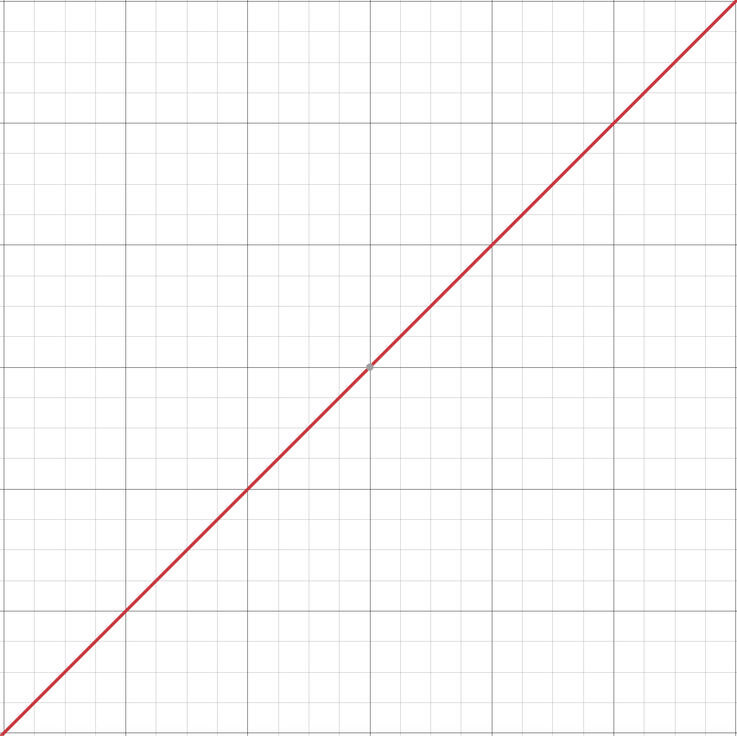

This post is `draft: true`, so it renders in `astro dev` (with a badge) but is
excluded from production builds. Keep it around as the formatting cheat sheet
for writing real articles, or delete it once the conventions are familiar.

## Rich text

Regular paragraph with **bold**, _italic_, **_bold italic_**, `inline code`,
and a [link to the repo](https://github.com/yugumishra/Yope3D). Links get the
accent color; external links need no special treatment.

> Blockquotes work too — good for pull-quotes, or for the recap paragraph
> convention at the top of each article.

- Unordered list
- Second item
  - Nested item

1. Ordered list
2. Second item

---

That was a horizontal rule (`---` on its own line).

## Code blocks

Fenced blocks get Shiki syntax highlighting (github-dark-default theme).
C++:

```cpp
// The per-archetype column cache: colIndex runs once per archetype,
// not per row per component.
for (auto [entity, hull, transform] : registry.view<Hull, Transform>()) {
    hull.velocity += gravity * dt;
    transform.position += hull.velocity * dt;
}
```

Python:

```python
import yope3d as y3

def init(ctx):
    for i in range(1000):
        e = ctx.world.add_sphere(pos=(0, i * 2.5, 0), radius=1.0)
        y3.reg_get(e, "Material").albedo = (0.8, 0.2, 0.2)
```

Plain text / shell:

```bash
cmake --preset mac-release
cmake --build build/mac-release --config Release
```

## Images

Co-locate images next to the post (e.g. `src/content/blog/images/`) and
reference them with a relative path. Astro optimizes and content-hashes them
at build time, and the base path is handled automatically:



For a caption, wrap a markdown image in a `<figure>` — the blank lines around
the `` line are **required** (they let the image go through the asset
pipeline; a raw HTML `` would not be processed and would 404
in production):

<figure>


<figcaption>Figure 1 — captions via figure/figcaption.</figcaption>
</figure>

The frontmatter `cover:` field (see this file's frontmatter) renders a hero
image between the title and the body — same relative-path rules.

## Video embeds

A bare `<iframe>` is styled full-width and responsive — no wrapper div needed.
YouTube (use the **embed** URL, not the watch URL):

<iframe src="https://www.youtube-nocookie.com/embed/M7lc1UVf-VE" title="Sample embed" loading="lazy" allowfullscreen></iframe>

For a self-hosted video, put the file in `site/public/videos/` and use a
`<video>` tag. Public assets are **not** base-path aware, so the `/Yope3D/`
prefix must be written out (drop it if the site ever moves to a custom
domain at `/`):

```html
<video controls muted playsinline src="/Yope3D/videos/trailer.mp4"></video>
```

## Tables

| Bodies | PGS (ms) | Notes                  |
| -----: | -------: | ---------------------- |
|  1,000 |     0.41 | baseline               |
|  4,000 |     1.73 | —                      |
| 16,000 |     7.9  | exceeds the 4ms budget |

Wide tables scroll horizontally instead of breaking the layout.

## Headings

`##` is the top article heading level (`#` is reserved for the title from
frontmatter). `###` and `####` are styled; deeper levels inherit defaults.

### A third-level heading

#### A fourth-level heading

That's everything. Delete this post or keep it as a reference — either way it
never ships.
