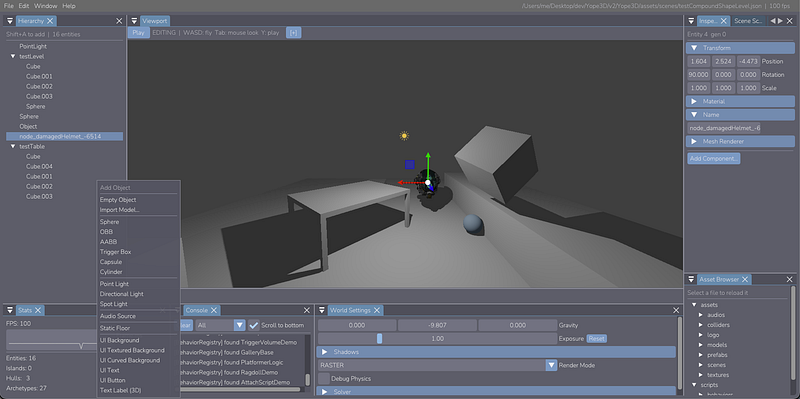

In this article about the Yope3D project, I will discuss the future of Yope3D
and its current state. As you may or may not know, Yope3D is my Java/LWJGL from
scratch physics engine that I've been working on intermittently. Readers of the past java series know about the 
struggle from [basic window rendering](https://medium.com/@yugumish/yope3d-basic-rendering-part-2-2dfe2aec2fa1) to [model loading](https://medium.com/@yugumish/yope3d-obj-file-reading-part-5-23c3a0f3d6d5) to [defining a rigid body's pose](https://medium.com/@yugumish/yope3d-texturing-themodel-matrix-part-8-e1bb09a2cf40) to a bit of [sphere-sphere physics](https://medium.com/@yugumish/yope3d-sphere-sphere-collisions-part-10-37e9aef0e455) and [springs](https://medium.com/@yugumish/yope3d-spring-mass-simulation-part-11-8c4a208886dc). 

The good news is, if you did **not** know, you don't need to. We'll cover all of that and more.
And if you pay attention to the dates, you may notice it has been quite some time since I last
updated the articles about this project. And in that time, a lot of changes
have occurred.

Let me start with the greatest.

**Yope3D is no longer a Java/LWJGL based physics engine.**

## Why?

Game Development, as a necessity, must get as close as it can get to the
hardware to wring as much performance as it can. A 16ms budget per frame
(60fps, long considered the standard for smoothness and even now slowly being eroded by higher
refresh rates) is very restrictive. Having an application like an engine burdened by Java's memory model
which takes all memory control out of your hands while putting absolutely everything on the heap and 
automatic garbage collection you can't schedule is a design paradigm that is 
simply contradictory to the performance needs of an engine. 
It's trying to build a gas efficient car but making the 
car out of the most unmalleable, heaviest, steel possible.
That steel may be the right tool for another job, but for what Game
Development does, the lightest, most flexible but supporting construction is
needed.

There's a reason most game devs stick to C++, and why Vulkan, the graphics API
developed by the Khronos Group (the same developers behind OpenGL) is praised 
for its verbosity (and sometimes annoyingly so) and clinging as close as possible to the graphics driver, 
providing the graphics API a game engine needs. And these needs are simply what guided
Yope3D along development to its current state.

Yope3D is now a full C++20 Vulkan Game Engine, with many more features than
the Java version had.

- The physics system is much more expanded 
  - A full rigid body parallel Projected Gauss Seidel solver running at a brutal budget of 4ms or 240 Hz.
  - Completely decoupled from rendering, on its own thread
  - Broadphase pair detection acceleration using the Sweep-and-Prune (SAP) technique
  - Narrowphase detection using the Separating Axis Test (SAT) with complex clipping for unbeatable manifold quality
  - Various constraint types being solved that allow much more complex physics than just collision (ragdolls, vehicles).
- The renderer has much more detail (shadows, glTF loading, PBR support).
- An entire Python scripting layer exists for behaviors on objects as well as
  setting up scenes.
- There's a scene editor now, with a live playable viewport so you can iterate
  and change scenes much faster.
- The entire engine switched mid development from plain OOP (an artifact from
  the Java days) to an ECS system, fully DOD, with contiguous memory and
  excellent cache locality (something we explicitly test and you'll get to
  see).

And much still left unmentioned. So many details about the implementations I've just
brushed over, of these monolithic projects in and of themselves disguised as
minor features in a game engine.

<figure>

<figcaption>Yope3D today</figcaption>
</figure>

Looking at the editor and the vast feature set, you may think it was simple feature addition that formed Yope3D. It wasn't.

It was iteration. Iteration fueled by the only thing that matters to game engines. Performance. Measured from the belly of the beast itself with a complex profiler and analyzer.
From Java to C++, from OOP to ECS, to shifts still happening in the codebase, and shifts that will happen.

And I want to tell you all about it. In the upcoming articles, we'll start
from the absolute basics (what a physics system needs and memory considerations). We'll start from absolute scratch (the single contact derivation) and then work up to solving more complex contacts, more than one set at once (multiple rigid bodies), solving at scale (thousands), and in parallel (where we are today).
We'll also do some detective work fixing elusive, pyramid collapsing, bugs. And by the end, the demos will literally make themselves (we'll watch the ragdoll stand up, on its own, reward hacking and showing us that missed case in the physics solver that needs fixing). 
Then we'll go beyond that as well (with a recently published, completely different, position based, approach to solving). Of course, we'll see
plenty of tasty visual demos and code snippets and algorithm explanation
diagrams along the way.

I'm so excited for it all!

If you want to see the code itself (of said advanced features), you can always
look at my GitHub here:
[https://github.com/yugumishra/Yope3D](https://github.com/yugumishra/Yope3D)

Please read the coming article series if you can! The next article will be
about "Physics, and why it needs to be Separate."
